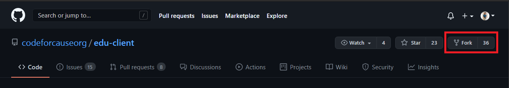
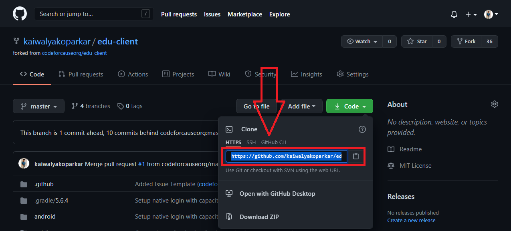
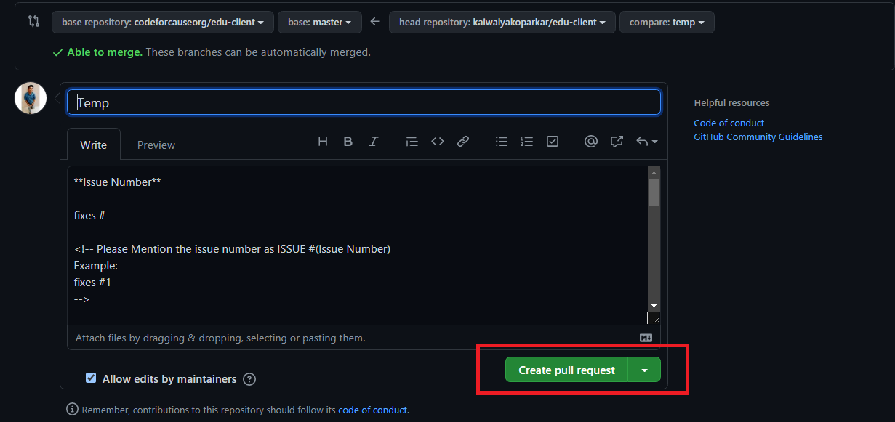

# Contributing

Thank you for considering and taking the time to contribute! Product focuses on 100% education as well as upskilling developing countries and rural areas.

The following are guidelines for contributing to this project.

## How to Report Bugs

Please open [a new issue in the appropriate GitHub repository][new-issue] with steps to reproduce the problem you're experiencing.

Be sure to include as much information including screenshots, text output, and both your expected and actual results.

## How to Request Enhancements

Firstly please refer to the applicable [github-repo] and search in the [issues-list] to make sure that your idea has not been (or is not still) considered.

If it is not yet considered or something more can be added then please create a new issue in the GitHub repository[new-issue] describing your enhancement.

Be sure to include as much detail as possible including step-by-step descriptions, specific examples, screenshots or mockups, and reasoning for why the enhancement might be worthwhile.

## 📌 Setting up Locale Environment

### 🚩 Forking repository :

1. Firstly you have to make your own copy of the project. For that, you have to fork the repository. You can find the fork button on the top-right side of the browser window. (Refer to the image below )
2. Kindly wait till it gets forked.
3. After that copy will look like `<your-user-name>/edu-client` forked from `codeforcause/edu-client`.
   

### 🚩 Clone repository :

1. Now you have your own copy of the project. Here you have to start your work.
2. Go to the desired location on your computer where you want to set up the project.
3. Right-click there and click on `git bash`. A terminal window will pop up
4. Type the command `git clone <your-fork-url>.git` and hit enter. (Refer to the image to copy URL)
5. Wait for few seconds till the project gets copied
   

### 🚩 Setting up remote :

1. Now you have to set up remote repositories.
2. Type 'git remote -v ' in the terminal to list remote connections to your repo.
3. It will show something like this:

```console

origin  https://github.com/<your-user-name>/edu-client.git (fetch)
origin  https://github.com/<your-user-name>/edu-client.git (push)

```

4. Now type the command `git remote add upstream https://github.com/codeforcauseorg/edu-client.git` this will set-upstream as the main directory.
5. Again type in the command `git remote -v` to check if the remote has been set up correctly.
6. It should show something like this :

```console

origin  https://github.com/<your-user-name>/edu-client.git (fetch)
origin  https://github.com/<your-user-name>/edu-client.git (push)
upstream        https://github.com/codeforcauseorg/edu-client.git (fetch)
upstream        https://github.com/codeforcauseorg/edu-client.git (push)

```

### 🚩 Creating a branch :

Whenever you want to contribute to any project. It is a best practice that you should create a branch and push the branch as PR rather than directly pushing the main/master branch.

1. `git branch` will list all the branches in the repository.
2. Now type `git branch <your-branch-name>` to create your branch.
3. You can check the created branch by `git branch`
4. But still if you start editing the edits will go to the main branch. To change the path, type in `git checkout <your-branch-name>`
5. Now you are ready to do the desired changes.

## 📌 Setting up .env file :

1. Create a new file `.env` in the root directory.
2. Copy all the default content from the `.env.example` file to the `.env` file.
3. You can edit this `.env` file to provide your own project credentials if needed in the future for specific tweaks and tests.


## 📌 Setting up project using `npm` :

1. Open this cloned folder in the text editor of your choice.
2. If you want to use the project using `npm` then that comes alongside when you download and install node js.

### 🚩 Running in Development mode :

1. Open the terminal and type in `npm install`, to install all the dependencies.
2. Run: `npm start`
3. Open [http://localhost:3000](http://localhost:3000) to view it in the browser.
4. The page will reload if you make edits.

### 🚩 Testing changes :

1. After doing changes type `npm test`. This launches the test runner in the interactive watch mode.
2. See the section about [running tests](https://facebook.github.io/create-react-app/docs/running-tests) for more information.

### 🚩 Building project :

1. Run the command `npm run build`
2. Builds the app for production to the `build` folder.
3. It correctly bundles React in production mode and optimizes the build for the best performance.
4. The build is minified and the filenames include the hashes.
   Your app is ready to be deployed!
5. See the section about [deployment](https://facebook.github.io/create-react-app/docs/deployment) for more information.

Skip the yarn part and proceed to the pushing the changes section [here](#-pushing-your-changes)

## 📌 Setting up project using `yarn`


1. Open this cloned folder in the text editor of your choice.
2. If you want to use the project using `yarn` then you can do either of the following
   1. Download Yarn Package manager [here](https://classic.yarnpkg.com/en/docs/install)
   2. If you already have `npm` installed you can simply type in `npm install --global yarn.
   3. If you already have `choco` installed you can simply type in `choco install yarn`
   4. If you already have `scoop` installed you can simply type in `scoop install yarn`
3. To check if the yarn has been installed correctly type in `yarn --version` this should show you the current version of yarn.


### 🚩 Running in Development mode :

1. Open the terminal and type in `yarn install`, to install all the dependencies.
2. Run: `yarn start`
3. Open [http://localhost:3000](http://localhost:3000) to view it in the browser.
4. The page will reload if you make edits.
5. You will also see any lint errors in the console.

### 🚩 Testing changes :

1. After changes type `yarn test`. This launches the test runner in the interactive watch mode.
2. See the section about [running tests](https://facebook.github.io/create-react-app/docs/running-tests) for more information.

### 🚩 Building project :

1. Run the command `yarn build`
2. Builds the app for production to the `build` folder.
3. It correctly bundles React in production mode and optimizes the build for the best performance.
4. The build is minified and the filenames include the hashes.
   Your app is ready to be deployed!
5. See the section about [deployment](https://facebook.github.io/create-react-app/docs/deployment) for more information.

### 🚩 Running storybook :

1. Run the command `npm run storybook`
2. wait on `localhost:6000`
3. write stories for the component in the `stories` folder under the `src` folder.

## 📌 Pushing your changes

After doing the changes, and when tests are successfully passing you can push your changes to remote.

1. Go to your terminal and type `git status` and hit enter, this will show your changes from the files.
2. Then type in `git add .` and hit enter, this will add all the files to the staging area.
3. Commit the changes by `git commit -m "<message-describing-your-change>"` and hit enter.
4. Now push your branch to your fork by `git push origin <your-branch-name>` and hit enter.

## 📌 Creating a pull request

By this time you can see a message on your GitHub fork as `your fork is ahead of codeforcause: master by <number> of commits` and you can also see a button `Compare and pull request`.

1. Click on `Compare and pull request` button.(Refer image no 1)
2. You will see a template.(Refer image no 2)
3. Fill the template completely by describing your change, cause of change, issue getting fixed etc.
4. After filling the template completely click on `Pull request`
   
   

[new-issue]: https://github.com/codeforcauseorg/edu-client/issues/new
[github-repo]: https://github.com/codeforcauseorg/edu-client/
[issues-list]: https://github.com/codeforcauseorg/edu-client/issues
